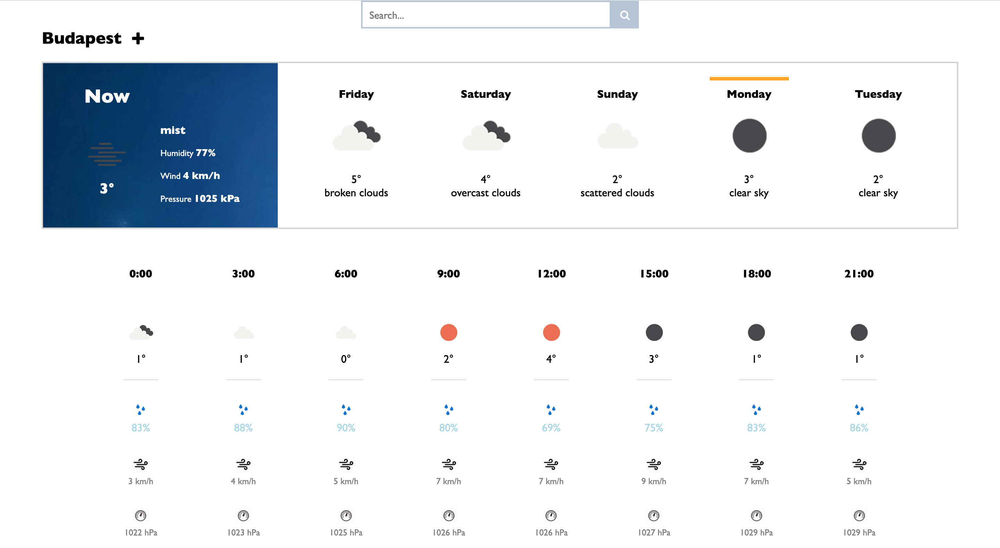

## Weather App

React front end of a weather forecast application (back end: https://github.com/lilkertesz/asp-net-weather-forecast).

### Daily and hourly forecast by city:

### Search bar with autocomplete city suggestions:

### City watchlist:

This project was bootstrapped with [Create React App](https://github.com/facebook/create-react-app).

### About

Look up weather forecasts or the current weather for any location, and save favorites to track the current weather of multiple locations.

---

Created with React.
https://github.com/facebook/react
